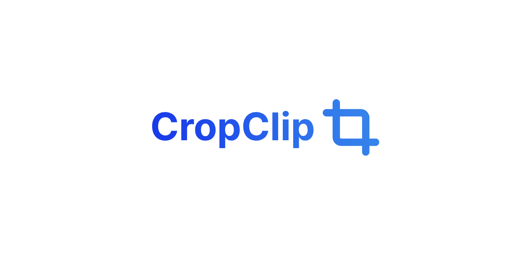

# **Crop Clip**

[](https://www.patreon.com/Gregorein)


An intuitive web application for cutting and exporting specific regions from images. Load multiple images, define custom cuts, and download them individually or collectively as a ZIP file.



## **Table of Contents**

- [Features](#features)
- [Demo](#demo)
- [Getting Started](#getting-started)
  - [Prerequisites](#prerequisites)
  - [Installation](#installation)
  - [Running the App](#running-the-app)
- [Usage](#usage)
  - [Loading Images](#loading-images)
  - [Adding Cuts](#adding-cuts)
  - [Navigating Images](#navigating-images)
  - [Zoom and Pan](#zoom-and-pan)
  - [Downloading Cuts](#downloading-cuts)
  - [Dark Mode](#dark-mode)
- [Keyboard Shortcuts](#keyboard-shortcuts)
- [Contributing](#contributing)
- [License](#license)
- [Contact](#contact)

---

## **Features**

- **Multiple Image Support**: Load and manage multiple images simultaneously.
- **Custom Cuts**: Define and adjust cut regions with ease.
- **Image Navigator**: Quickly navigate between images and view cuts.
- **Zoom and Pan**: Zoom in/out and pan around images for precise cutting.
- **Download Options**:
  - Download individual cuts.
  - Download all cuts as a single ZIP file.
- **Dark Mode**: Toggle between light and dark themes.
- **Responsive UI**: A clean and intuitive interface that adapts to different screen sizes.
- **Keyboard Shortcuts**: Improve efficiency with handy shortcuts.

## **Demo**

Check out the live demo [here](#). <!-- Provide the link to your live demo if available -->

---

## **Getting Started**

### **Prerequisites**

- **Node.js**: Ensure you have Node.js installed. You can download it [here](https://nodejs.org/).

### **Installation**

1. **Clone the Repository**

   ```bash
   git clone https://github.com/Gregorein/CropClip.git
   cd CropClip
   ```

2. **Install Dependencies**

   ```bash
   npm install
   ```

   Or if you use Yarn:

   ```bash
   yarn install
   ```

3. **Running the App**  
   Start the development server:
   
   ```bash
   npm start
   ```

   Or with Yarn:
   ```bash
   yarn start
   ```
   
   Open your browser and navigate to http://localhost:3000 to view the app.

### **Usage**
1. Loading Images

   * Click the Load Images button on the toolbar, or drag and drop images onto the app.
   *  Supported formats: JPEG, PNG, GIF, and other common image formats.

2. Adding Cuts

   * Click the Add Cut button (Scissors icon) or press the Spacebar.
   * A resizable and movable cut rectangle will appear on the image.
   * Adjust the size and position by dragging the edges or the entire rectangle.

3. Navigating Images

   * Use the Previous and Next arrows in the Image Navigator to switch between images.
   * Click on an image name in the list to select it.
   * Images with cuts will display a badge indicating the number of cuts.

4. Zoom and Pan

   * Zoom In and Zoom Out using the magnifying glass icons.
   * Reset Zoom to return to the default zoom level.
   * Fit to Window adjusts the image to fit the viewport.
   * Pan by clicking and dragging on the image.

5. Downloading Cuts

   * Download Individual Cuts:
      *  Click the Download button (Image with down arrow) in the Image Navigator.
   * Download All Cuts:
      *  Click the Download All button (Down arrow icon) in the Image Navigator.
      *  All cuts will be downloaded as a single ZIP file.

6. Dark Mode

   * Open the About modal by clicking the Info icon.
   * Toggle Dark Mode using the switch.
   * Your theme preference will be saved for future visits.

### Keyboard Shortcuts

   * Spacebar: Add a new cut to the active image.
   * Arrow Left: Navigate to the previous image.
   * Arrow Right: Navigate to the next image.
---

### Contributing
Contributions are welcome! Please follow these steps:

1. Fork the Repository
   Click the Fork button at the top right of the repository page.

2. Create a Branch
   ```bash
   git checkout -b feature/YourFeatureName
   ```
3. Commit Your Changes
   ```bash
   git commit -m 'Add some feature'
   ```

4. Push to the Branch
   ```bash
    git push origin feature/YourFeatureName
   ```

5. Open a Pull Request  
Submit your pull request, and we'll review it as soon as possible.

## License

This project is licensed under the MIT License.

## Support

If you find this project helpful, please consider supporting me on Patreon.

[](https://www.patreon.com/Gregorein)


## Contact
- Twitter: [@Gregorein](https://x.com/Gregorein) 
- Email: [hello@gregore.in](mailto:hello@gregore.in)
- GitHub: [Gregorein](https://github.com/Gregorein)
